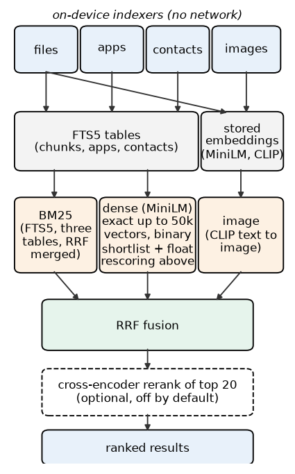

# LocalSeek: private hybrid search for Android

LocalSeek is an on-device search app for Android. One search box covers files, installed apps, contacts and, optionally, images. Results
from a lexical retriever (SQLite FTS5, BM25) and a dense retriever (MiniLM sentence embeddings) are merged with reciprocal-rank fusion.
Indexing and search run on the phone and the app declares no network permission. The current version is 1.0.0 (versionCode 2); it is the
subject of a pre-registered study and of follow-up measurements described below, and it is not yet published on Google Play.

## Features (version 1.0.0)

- **Search across** files in Documents and Download, installed apps, contacts and, optionally, images.
- **File formats read:** PDF (first 10 pages) and plain-text formats such as txt, md, csv, json, xml, html, code and config files (first 100 KB). Word, Excel and other Office formats are not indexed.
- **Lexical search:** FTS5 with BM25 over three tables (file chunks, apps, contacts), merged by reciprocal-rank fusion.
- **Dense search:** all-MiniLM-L6-v2 embeddings (LiteRT/TFLite). The index is size-adaptive: exact in-memory search up to 50,000 chunks, and above that a binary shortlist re-scored with the float vectors (k' = 200). A phone with the author's corpus has about 13.7k chunks, so it uses the exact path.
- **Fusion:** reciprocal-rank fusion (the shipped setting; other modes exist in the code for the benchmark arms).
- **Cross-encoder reranking:** an experimental user setting, off by default. It adds several seconds to every search (about 5 s on the test phone) and was not shown to improve results.
- **Image search** with CLIP text-to-image (optional; the model files are an on-demand asset pack and are not in git, see Build).
- **Search tools** in the results screen: calculator, unit and date helpers, web-search hand-off to the browser, pinned results, a quick-settings tile and a widget.
- **Not in the app:** any cloud or language-model feature, DOCX indexing, live file-system watching.

The LSH index that earlier versions used for dense search is no longer built or loaded by the app. Its code stays in the repository because the benchmark arms that were studied (E3, E5, E12) use it.

## How it works



Indexers read files, apps, contacts and images and store text in FTS5 tables and embeddings next to them. At query time the BM25,
dense and (if enabled) image retrievers run, reciprocal-rank fusion merges their lists, an optional cross-encoder re-scores the top 20,
and the results are grouped by type. Apps and contacts are found by FTS and by an exact scan of their embeddings, independent of the
dense index type. The figure is `docs/paper/figures/fig_arch.pdf` (vector) and `.png`.

## Privacy

No `INTERNET` permission is declared in the app manifest (a build step fails if any merged manifest contains it), backups are disabled
(`allowBackup="false"`) and the index lives in app-private storage. Permissions requested: contacts, all-files access (to read Documents
and Download), media images, and a foreground service for indexing. See [PRIVACY.md](PRIVACY.md).

## Build

Requirements: Android Studio (recent stable), JDK 17 or newer, Android SDK 36.

```bash
./scripts/fetch_models.sh                  # CLIP model files for image search (verified by SHA-256; not stored in git)
./gradlew :app:testDebugUnitTest :app:assembleDebug
./gradlew :app:bundleRelease               # release bundle
python3 -m unittest discover -s eval       # Python tests for the analysis code
```

A `benchmark` build type (release-like, not debuggable, R8 off, debug signing) exists for latency measurements:
`./gradlew -PlsTestBuildType=benchmark :app:assembleBenchmark :app:assembleBenchmarkAndroidTest`.
Third-party model licences: [THIRD_PARTY_NOTICES.md](THIRD_PARTY_NOTICES.md).

## Research summary

All numbers are nDCG@10 unless stated; sources are in [docs/paper/RESULTS_FOR_PAPER.md](docs/paper/RESULTS_FOR_PAPER.md).

**Registered study (OSF [vwmfz](https://osf.io/vwmfz)).** Nine retrieval configurations compared on 95 queries written by the owner of the test phone
(77 scored queries in 64 clusters, registered cluster analysis; [SETB_RESULTS.md](docs/investigations/SETB_RESULTS.md)):

| item | value | 95% CI | Holm p |
|---|---|---|---|
| E9 hybrid RRF, exact dense search (what the app ships) | 0.838 | [0.781, 0.890] | n/a |
| E12 replica of the pre-release app configuration | 0.692 | [0.616, 0.762] | n/a |
| H5 E9 - E12 | +0.1468 | [0.0804, 0.2125] | 0.0002 |
| H3 E1b - E1 (RRF merge of the three BM25 tables) | +0.1051 | [0.0390, 0.1739] | 0.0118 |
| H1 E9 - E5 (exact vs LSH dense in the hybrid), by cluster | +0.0437 | [-0.0067, 0.0948] | 0.2846 (no evidence of a difference) |

**Exploratory contrasts, not registered, computed after the registered results were known** ([AQ_HYBRID_CONTRASTS.md](docs/investigations/AQ_HYBRID_CONTRASTS.md); Holm over these four only):

| contrast | difference | 95% CI | Holm p |
|---|---|---|---|
| hybrid vs BM25 (E9 - E1) | +0.2543 | [0.1710, 0.3389] | 0.00002 |
| hybrid vs dense exact (E9 - E2) | +0.0514 | [-0.0083, 0.1134] | 0.1032 |
| dense exact vs BM25 (E2 - E1) | +0.2029 | [0.0884, 0.3139] | 0.0024 |
| reranked hybrid vs dense exact (E10 - E2) | +0.0646 | [0.0029, 0.1274] | 0.0974 |

The hybrid was much better than BM25 alone; its advantage over exact dense search alone is not distinguishable from zero in this study.

**Study 2, scaling on the phone** ([AN](docs/investigations/AN_SCALING_RESULTS.md), [release-build check](docs/investigations/AQ_RELEASE_LATENCY.md)): on public vectors, exact float32 search has p95 23.9 ms at 50k vectors and 66 ms at 100k; a binary shortlist with float re-scoring keeps p95 at or below 19 ms up to 200k with recall@10 0.944 to 0.982; HNSW at efSearch 32 or more keeps p95 at or below 7.3 ms up to 100k. This is why the app switches index type at 50,000 chunks.

**Study 3, public-data replication** ([AO](docs/investigations/AO_PUBLIC_REPLICATION_RESULTS.md); exploratory, planned before computing, not pre-registered): on five BEIR corpora the LSH configuration of the old app loses most neighbours (hybrid with exact search is +0.06 to +0.21 better), reranking the top 20 changes nothing detectably, and alternative embedders help on some corpora and not on others.

Limits: one assessor wrote the queries, owns the phone and judged the results; raw data are private and not published. Single-phone timings are descriptive.
How to run the analysis code: [eval/README.md](eval/README.md). Project status and to-dos: [docs/STATUS.md](docs/STATUS.md); document index: [docs/README.md](docs/README.md).

## Authors and acknowledgements

Greenal Rajkumar Tambe, Parikshit Patil, Kartik Thakur and Archit Utsahi, Department of Information Technology, Sardar Patel Institute of
Technology, Mumbai, India.

The authors thank their project guide, Pallavi Thakur (Department of Information Technology, Sardar Patel Institute of Technology), for guidance.

## Licence

Code: Apache License 2.0 ([LICENSE](LICENSE), [NOTICE](NOTICE)). Documentation under `docs/`: CC BY 4.0. Third-party components: [THIRD_PARTY_NOTICES.md](THIRD_PARTY_NOTICES.md).

## Citation

See [CITATION.cff](CITATION.cff).
